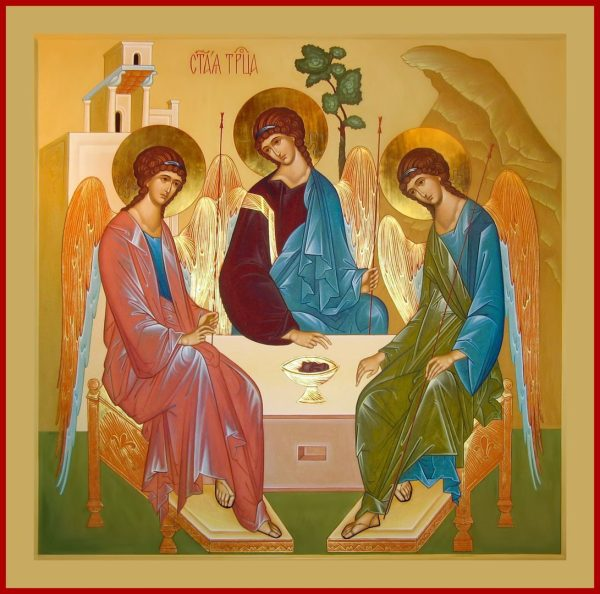
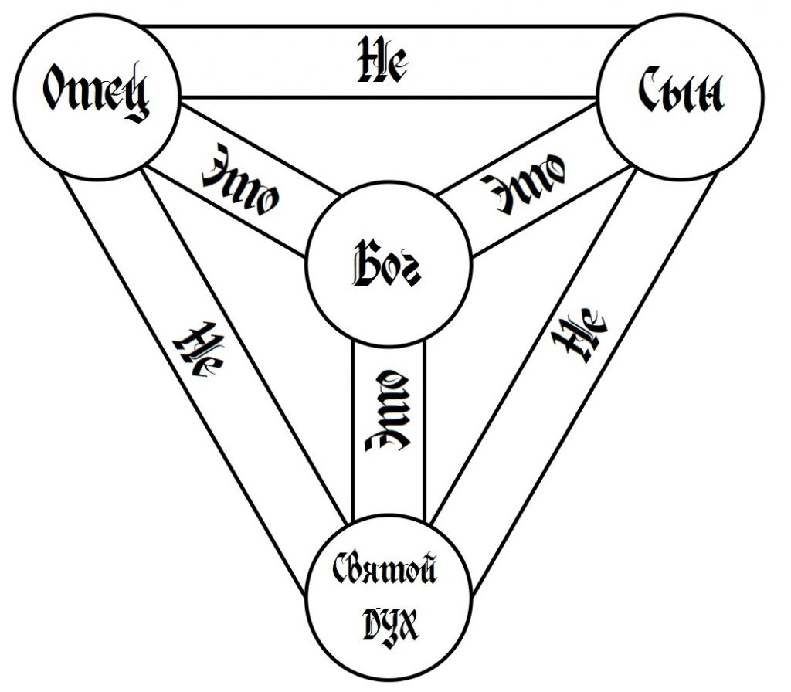
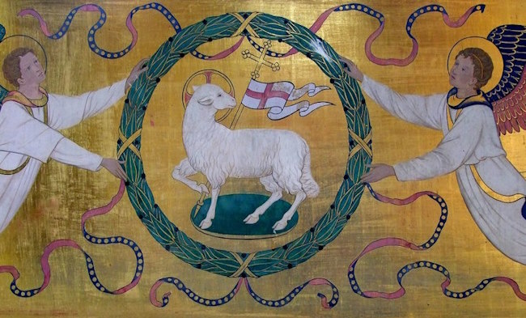
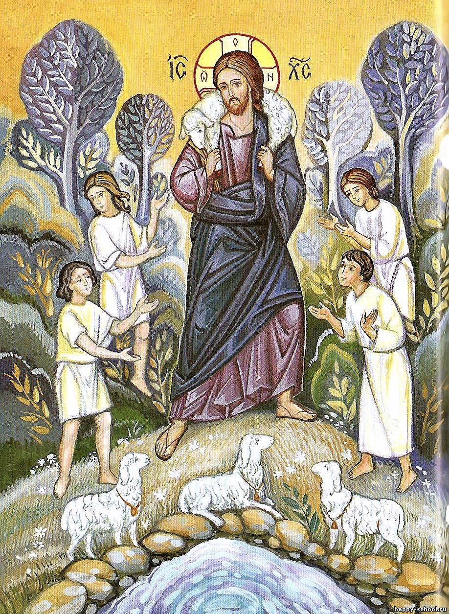
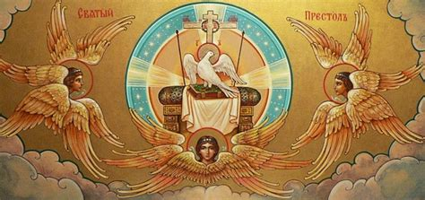

# Мировые религии

## Буддизм

### Мета

- Время возникновения: VI в. до н.э. (Индия)
- Территория распространения: Индия, ЮВА (Мьянма, Таиланд, Лаос, Камбоджа), Китай (в частности, Тибетский а-р), Монголия, Россия (Тува, Бурятия)
- Берет истоки из индуизма

### Учение Будды

**Четыре благородные истины**:  
1. Существует страдание - духкха
2. Существует причина страдания - жажда
3. Существует прекращение страдания - ниродха
4. Существует путь, ведущий к прекращению страдания - Благородный Восьмеричный путь

Цель:  
Выйти из *сансары* - бесконечного цикла смерти и рождения (*реинкарнации* - перерождения). Достичь *нирвану*

### Понятия

- **Сансара** - бесконечный цикл перерождения
- **Реинкарнация** - процесс (идея) перерождения (переселения душ) в какое-то существо
- **Карма** - вселенский закон, в котором хорошие и плохие действия человека определяют его судьбу, в частности реинкарнацию
- **Брахманы** - члены высшей варны общества (те, кто приблизился к нирване)
- **Веды** - сборник древних священных писаний индуизма на санскрите
- **Нирвана** - конечная (высшая) цель - выход из сансары - спокойствие

## Христианство

### Мета

- Время возникновения: I в. н.э. (Израиль/Палестина, Римская империя)
Источники возникновения:  
1. Иудаизм (Ветхий завет)
2. Античная философия (любви и принятия)
3. Зороастризм (бесконечная борьба белого и черного)

### Библия

**Библия** - священная книга христиан. Состоит из двух заветов:  
- *Ветхий завет* - сотворение мира, завет Бога с Авраамом, история Израиля, пророчества о Мессии
- *Новый завет* - история жизни, смерти и воскрешения Иисуса Христа, учение Иисуса, становление первых церквей

### Жизнь и смерть Иисуса

1. *Избиение младенцев*. По стране распространяется пророчество о рождении Мессии, который спасет Израиль и "вернет его к прежнему величию". Император Август приказывает казнить всех младенцев. Мария (мать Иисуса) и Иосиф (ее муж) с новорожденным Иисусом бегут из Вифлиема в Египет, как им повелел ангел
2. *Рождение Иисуса*. Иосиф и Мария жили в Назарете, но родом Иосиф был из Вифлиема. В это время проводилась перепись населения, из-за чего каждый возвращался в свой родной город, поэтому Иисус родился в Вифлиеме. В ту ночь Иосиф и Мария не смогли найти ночлег, и Мария родила Иисуса в хлеву. Над хлевом святилась Вифлеемская звезда, по которой волхвы нашли Иисуса и принесли ему дары
3. *Крещение*. Иисуса, как и многих других в то время, крестил Иоанн креститель (не путать с апостолом). Иисусу было около 30 лет. Во время крещения на Иисуса спустился Святой Дух и был голос с неба "Ты Сын Мой Возлюбленный; в Тебе Моё благоволение!" После этого Иисус 40 дней без еды и воды провел в пустыне, подвергаясь искушениям сатаны
4. *Проповедь*. После этого Иисус творил чудеса (превращал воду в вино, давал зрение слепым, исцелял больных, воскрешал людей и т.д.) и проповедовал, в т.ч. через эти чудеса
5. *Казнь*. Иуда (один из апостолов) предал Иисуса за 30 серебреников. Иудейские первосвязенники осудили Иисуса Христа на смерть, но власть принадлежала римскому наместнику, из-за чего суд перешел к Понтию Пилату. Пилат не нашел вины в Иисусе, но, чтобы не допустить беспорядков в городе, предложил народу выбрать, кого казнить: Иисуса или Варавву (умыл руки). Иисус был распят на горе Голгофе. "Отче! в руки Твои предаю дух Мой". 

### Апостолы

Всего 12, знать: Петр, Андрей, Павел

### Евангелисты, тетраморфы

- Матфей - изображается как человек (часто рядом ангел)
- Марк - как лев
- Лука - как телец
- Иоанн - как орел

### Отличия католической от православной церкви

|            | Православие                                        | Католицизм                                 |
|------------|----------------------------------------------------|--------------------------------------------|
| Центр      | Поместные церкви                                   | Единый центр в Ватикане                    |
| Глава      | Патриархи (равны между собой)                      | Папа Римский                               |
| Святой Дух | только от Отца                                     | от Отца и от Сына                          |
| Чистилище  | Нет                                                | Да                                         |
| Обряды     | Причастие хлебом и вином. Креститься справа налево | Причастие хлебом. Креститься слева направо |
| Целибат    | Только для монахов                                 | Для всех священников                       |

### Понятия

- **Интердикт** (в католичестве) - временное запрещение всех церковных дейтсвий, налагаемое папой или епископом, обычно, на население страны или города
- **Индульгенция** (в католичестве) - освобождение от наказания за грехи, в частности за деньги
- **Схизма** - церковный раскол
- **Чистилище** (в католичестве) - состояние, в котором прибывают души людей, которые умерли в мире с Богом, но нуждаются в очищении от последствий совершенных при жизни грехов
- **Цезаропапизм** (в католичестве) - когда глава государства считается главой Церкви
- **Догмат** - утвержденное церковью положение вероучения, объявленное обязательной истиной
- **Вселенские соборы** - собрания высших духовных санов для обсуждения догматов, церковно-политических вопросов и проч.
- **Символ веры** - задокументированный перечень основополагающих догматов христианского вероучения

### Символы

> мб пикчи будут попозже

#### Троица

#### Агнец

#### Добрый пастырь

#### Рыбаки (ловцы душ)

#### Святой дух (голубь)

#### Ихтис (рыба)

#### Хризма (ΧΡΙΣΤΌΣ, начало и конец)

### Догматы

1. Вера в триединного Бога
2. О творении мира
3. О падении высшего ангела
4. О первородном грехе
5. Об искуплении человечества от грехов
6. О необходимости благодати Божией для освящения человека
7. О Таинстве Церкви
8. О честном суде человека после смерти

## Ислам

### Мета

- Время возникновения: VII в. н.э.
- Берет истоки из иудаизма и христианства

### Основы исламского вероучения

- Священная книга - Коран - совокупность учений пророка Мухаммеда и историй о нем

Пять основных обязанностей мусульман:  
1. Исповедание веры (шахада)
2. Молитва (араб. салят, перс. намаз)
3. Пост в месяц рамадан (араб. саум, перс. ураза)
4. Милостыня (закят)
5. Паломничество в Мекку (хадж)

### Понятия

1. **Кааба** - святыня в виде черного куба
2. **Мекка** - священный город мусульман
3. **Медина** - второй священный город мусульман после Мекки
4. **Коран** - священная книга мусульман
5. **Шариат** - комплекс предписаний, определяющих убеждения, а также формирующих религиозную совесть и нравственные ценности мусульман
6. **Хадж** - поломничество в Мекку
7. **Джихад** - понятие, означающее усердие на пути Аллаха, борьба за веру
8. **Сунниты** - последователи основного и наиболее многочисленного направления в исламе
9. **Шииты** - направление ислама, объединяющее различные общины, признавшие Али ибн Абу Талиба (двоюродного брата, зятя и сподвижника пророка Мухаммеда) и его потомков единственно законными наследниками и духовными преемниками пророка Мухаммеда
